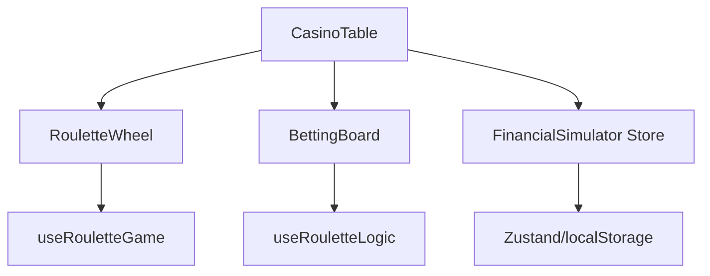

# GHR Ruleta Royale 🎰

[](https://github.com)
[](https://github.com)
[](LICENSE)

Una aplicación de ruleta europea profesional construida con React y Vite.

## 🚀 Inicio Rápido

```bash
# Instalar dependencias
npm install

# Ejecutar en desarrollo
npm run dev

# Ejecutar tests
npm test

# Build para producción
npm run build
```

## 📁 Estructura del Proyecto

```
src/
├── components/       # Componentes React (RouletteWheel, BettingBoard, etc.)
├── hooks/           # Custom hooks (useRouletteGame, useCurrency, etc.)
├── logic/           # Lógica de negocio (FinancialSimulator, RouletteUtils)
├── config/          # Configuración (GameLimits, Theme)
├── utils/           # Utilidades (SoundManager, BetValidator)
└── tests/           # Tests unitarios y snapshots
```

## 🏗️ Arquitectura



### Flujo de Datos
1. **Usuario** coloca apuestas en `BettingBoard`
2. **FinancialSimulator** (Zustand) gestiona el saldo y las transacciones
3. **useRouletteGame** maneja la física del giro y RNG seguro
4. **RouletteUtils** calcula ganancias y cobertura

## 🧪 Testing

```bash
# Ejecutar todos los tests
npm test

# Modo watch
npm run test:watch
```

### Cobertura de Tests
- `RouletteUtils.js` - 61 tests
- `useRouletteGame.js` - 33 tests
- `FinancialSimulator.js` - 50 tests
- `ComponentSnapshots` - 13 tests

## 🔧 Scripts Disponibles

| Script | Descripción |
|--------|-------------|
| `npm run dev` | Servidor de desarrollo (puerto 5173) |
| `npm run build` | Build de producción |
| `npm run preview` | Preview del build |
| `npm test` | Ejecutar tests |
| `npm run test:watch` | Tests en modo watch |
| `npm run lint` | Ejecutar ESLint |

## 📦 Tecnologías

- **React 18** - UI Library
- **Vite** - Build tool
- **Zustand** - State management
- **Vitest** - Testing framework
- **ESLint** - Linting

## 🎮 Características

- ✅ Ruleta Europea Realista (37 números)
- ✅ Sistema financiero completo con historial
- ✅ Múltiples tipos de apuestas (Pleno, Medios, Calles, etc.)
- ✅ Animaciones y sonidos inmersivos
- ✅ Modo Demo y Modo Real
- ✅ Layout personalizable (drag & drop)
- ✅ Estadísticas y análisis de estrategias
- ✅ Sistemas de apuestas (SYSTEM 26, 23, 10)

## 🤝 Contribuir

1. Fork el repositorio
2. Crea tu branch (`git checkout -b feature/nueva-funcionalidad`)
3. Commit tus cambios (`git commit -m 'Agregar nueva funcionalidad'`)
4. Push al branch (`git push origin feature/nueva-funcionalidad`)
5. Abre un Pull Request

## 📄 Licencia

MIT © 2025 GHR Ruleta Royale
